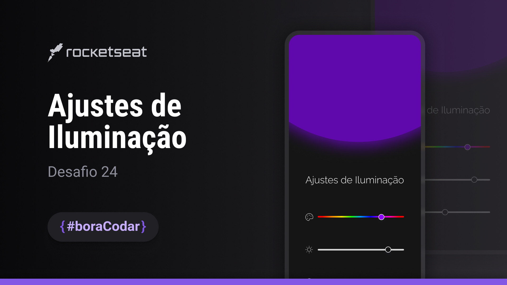

<h1 align="center"><b>#boraCodar</b> Ajustes de Iluminação</h1>

  <a href="#-tecnologias">Tecnologias</a>&nbsp;&nbsp;&nbsp;|&nbsp;&nbsp;&nbsp;
  <a href="#-projeto">Projeto</a>&nbsp;&nbsp;&nbsp;|&nbsp;&nbsp;&nbsp;
  <a href="#-layout">Layout</a>&nbsp;&nbsp;&nbsp;|&nbsp;&nbsp;&nbsp;
  <a href="#memo-licença">Licença</a>

  

 

  

## 🚀 Tecnologias

Esse projeto foi desenvolvido com as seguintes tecnologias:

- React.js
- SCSS

## 💻 Projeto

O desafio é codar um app de ajuste de iluminação. No desenvolvimento você pode ir além do proposto, utilizando a sua criatividade.

Esse desafio foi criado para o #boracodar, um projeto da Rocketseat com desafios semanais para você praticar desenvolvendo como achar melhor e evoluir seu código para o próximo nível.

## 🔖 Layout

Você pode visualizar o layout do projeto através [DESSE LINK](https://www.figma.com/community/file/1250810959627241982). É necessário ter conta no [Figma](https://figma.com) para acessá-lo.

## 📝 Licença

Esse projeto está sob a licença MIT.
